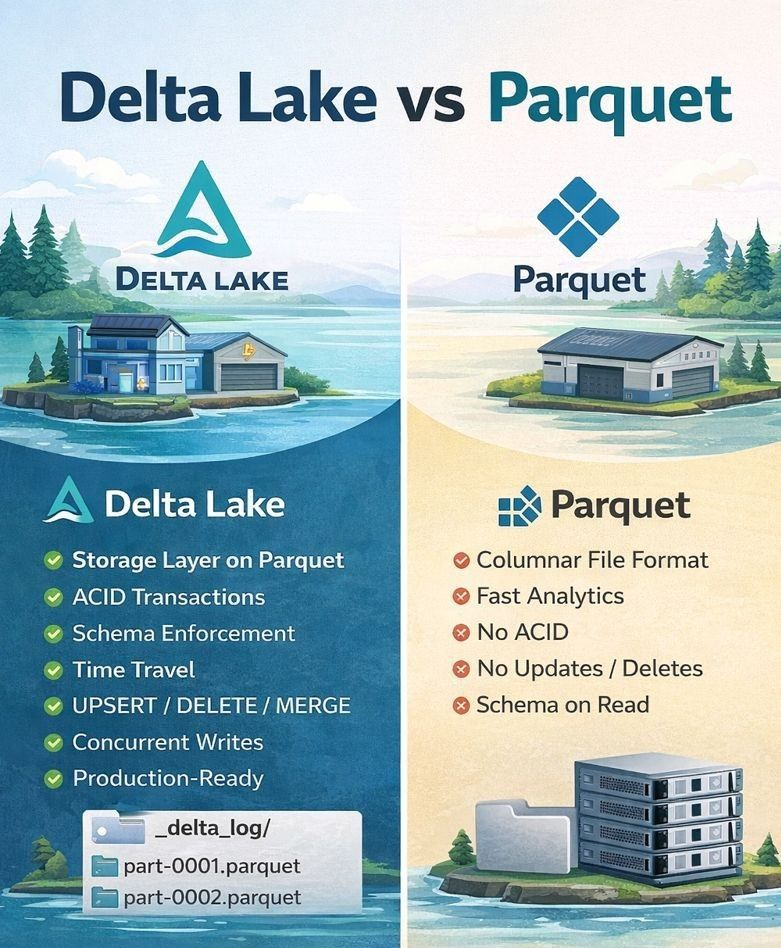

## **Delta Lake vs Parquet.**

While Parquet is a powerful columnar file format, Delta Lake adds a transaction layer on top of Parquet, enabling enterprise-grade data reliability and management.

---

## 🔹 Parquet (File Format)

Parquet is optimized for analytical workloads with:

* ✅ Column-based storage
* ✅ High compression
* ✅ Predicate pushdown
* ✅ Fast read performance

### Limitations:

* ❌ No ACID transactions
* ❌ No schema enforcement
* ❌ No updates/deletes (full rewrite required)
* ❌ Risk of corruption in concurrent writes

---

## 🔹 Delta Lake (Storage Layer on Parquet)

**Delta Lake = Parquet + Transaction Log (`_delta_log`)**

Delta adds critical capabilities for production-grade pipelines:

* ✅ ACID Transactions
* ✅ Schema Enforcement & Evolution
* ✅ Time Travel (Data Versioning)
* ✅ UPSERT / DELETE / MERGE
* ✅ Handles concurrent reads & writes
* ✅ Supports batch + streaming
* ✅ Automatic rollback on failures

---

## 🔹 Key Production Advantages

### 🛡️ Schema Enforcement

Delta validates schema on write: bad data is rejected early, preventing silent failures.

### ⏪ Time Travel

Query previous versions of data for:

* • Debugging issues
* • Auditing
* • Recovering from bad loads

### ⚙️ Performance Maintenance

Delta provides built-in operations:

* • OPTIMIZE – compacts small files
* • VACUUM – removes old unused files

---

## 🔄 Reliable Failure Handling

If a job fails mid-write:

* • Parquet → partial files remain
* • Delta → transaction automatically rolled back
* ➡️ No half-written data

---

## 🔹 When to Use What

### ✅ Use Parquet when:

* • Append-only data
* • Single writer
* • Raw / archival storage

### ✅ Use Delta Lake when:

* • Multiple pipelines write
* • Updates or deletes needed
* • Schema changes frequently
* • Production tables
* • Data reliability matters

---

## ✅ Final Note

**Delta Lake is the standard for building reliable, scalable, production-grade data lakes.**

---
