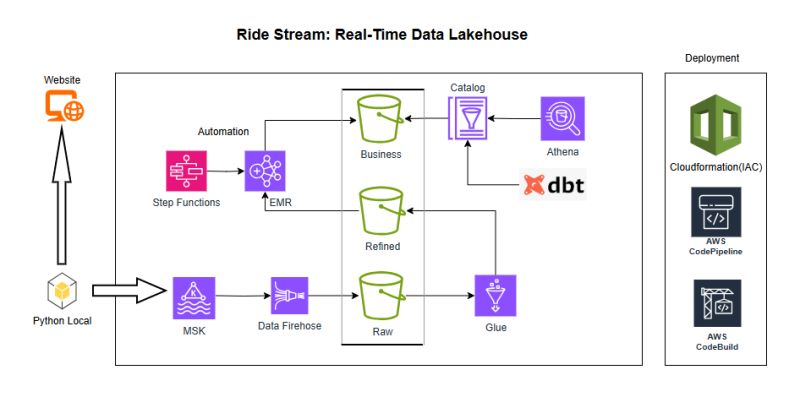

# 🚕 Ride Stream: Real-Time Data Lakehouse Data Engineering Project

## Overview

Not a toy ETL. Not a fake CSV pipeline. A **proper production-style streaming + lakehouse system**.

This is the kind of architecture companies actually run.

## What This Project Teaches You

Here's what this project teaches you by building it end-to-end:

### Real-Time Event Flow

You start with real-time events (like a ride-booking app):

- A Python producer sends events
- Data flows into Kafka (MSK)
- Then into Firehose
- Lands in S3 Raw

### Data Processing Pipeline

From there:

- Glue handles cataloging
- EMR + Spark does heavy transformations
- Step Functions orchestrate the whole pipeline
- Data moves from Raw → Refined → Business
- dbt handles analytics transformations
- Athena is used for querying

### Deployment & CI/CD

And the whole thing is deployed using:

- CloudFormation (IaC)
- CodeBuild + CodePipeline

## Key Learning Outcomes

So you're not just learning Spark or AWS. You're learning:

✅ How real streaming systems are designed  
✅ How lakehouse layers actually work in practice  
✅ How orchestration works in production  
✅ How analytics engineering (dbt) fits into data platforms  
✅ How to think like a data platform engineer, not just an ETL writer

## Why This Project Matters

This is exactly the kind of project:

- That makes your resume stand out
- That gives you real system design confidence
- That helps you crack "design a data platform" interviews

## Get Started

I'm adding this as a full guided project inside DataVidhya.

If you've ever felt: *"I know tools… but I don't know how everything fits together in real life"*

**This project is for you.**

🫵🏻 You can find the project below 👇🏻

---